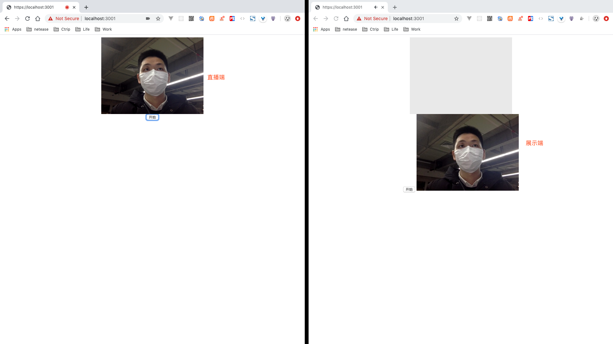

# Live Video Demo

本项目是博文[web音频流转发之音视频直播](https://segmentfault.com/a/1190000011492525)的实践。作者贴的代码有点小瑕疵，不能即时跑起，比如`AudioContext`实例创建时机、https秘钥生成等，详细看git log。

* 视频直播：采集一帧一帧的视频，转换为base64转发，接收到base64后，设置为img的src，然后不停的修改img的src形成视频
* 音频直播：采集一帧一帧的音频二进制数据，转发2进制数据，在接收端对2进制原始音频数据进行播放

以下是最终Demo效果：


## Usage

1. 下载 & 运行项目

``` bash
git clone https://github.com/lq782655835/live-video-demo.git

yarn && yarn dev
```

2. 开启两个https://localhost:3001（注意是https协议）页面，一个作为直播端，一个作为展示端。

## SSL问题

git clone项目后，执行`yarn dev`后可能遇到SSL错误。因为项目中自签名证书是基于作者机器，如果遇到SSL报错问题，可以通过执行以下命令，生成本机的自签名证书。

``` sh
# 1.生成私钥
openssl genrsa -out key.pem 2048
# 2.生成 CSR (Certificate Signing Request)
openssl req -new -key key.pem -out certrequest.csr
# 3.生成自签名证书
openssl x509 -req -in certrequest.csr -signkey key.pem -out key-cert.pem
```

> 生成CSR时要求填一些信息，可随意字符串填写。
